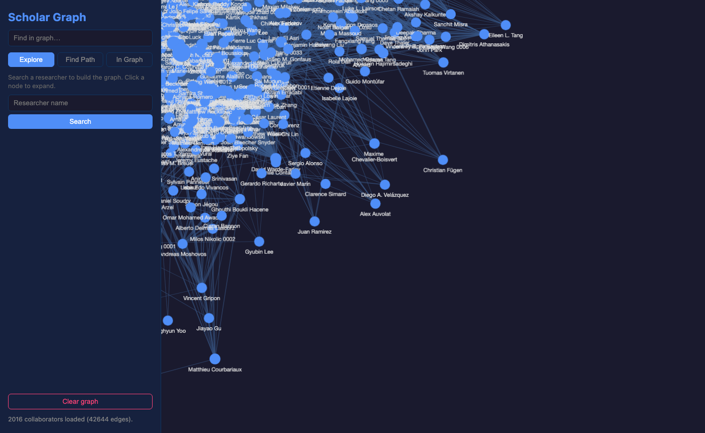
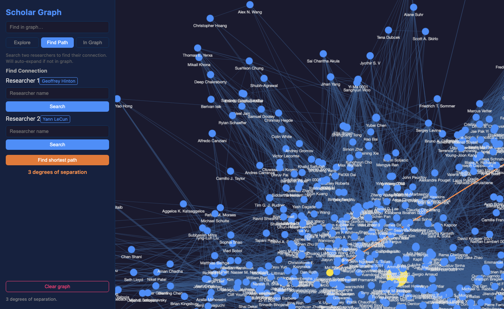

# Scholar Graph

An interactive CS collaboration graph explorer powered by [DBLP](https://dblp.org). Search researchers, explore coauthor networks, and find the shortest path between any two people in computer science.

  



*Yoshua Bengio's coauthor network — click any node to expand.*



*Geoffrey Hinton → Yann LeCun in 3 degrees of separation.*

## Features

- **Author search** — search any CS researcher by name
- **Collaboration graph** — click any node to expand their coauthor network; nodes sized by paper count
- **Hover tooltips** — shows affiliation and shared paper counts
- **Find in graph** — fuzzy search within already-loaded nodes
- **Find Path** — find shortest collaboration path between any two researchers (instant, fully local BFS on 30M coauthor pairs)

## Setup

### Option A: Docker (recommended)

**Prerequisites:** [Docker](https://docs.docker.com/get-docker/) with Compose v2.

```bash
git clone https://github.com/YabingQi/scholar-graph.git
cd scholar-graph
docker compose up
```

Open [http://localhost:3000](http://localhost:3000). Search and graph exploration work immediately.

> **API docs:** available at [http://localhost:8000/docs](http://localhost:8000/docs) (Swagger UI) while the backend is running.

**To enable Find Path** (requires a ~1 hour one-time build):

```bash
docker compose run --rm builder
```

This downloads the DBLP XML dump (~1 GB) and builds a local SQLite graph (~5.6 GB) with 30 million coauthor pairs. The database persists in a Docker volume and survives restarts.

To refresh with the latest DBLP data:

```bash
docker compose run --rm builder python build_graph.py --force
```

---

### Option B: Manual setup

**Prerequisites:** Python 3.11+, Node.js 18+

```bash
git clone https://github.com/YabingQi/scholar-graph.git
cd scholar-graph
```

**Backend:**
```bash
cd backend
python3 -m venv .venv
source .venv/bin/activate
pip install -r requirements.txt
```

**Build the local graph database** (optional — enables Find Path):

```bash
python3 build_graph.py
```

This downloads the DBLP XML dump (~1 GB) and builds a local SQLite graph (~5.6 GB).  
**Expected time:** ~3 min to download, ~50 min to parse. Use `--force` to rebuild.

**Frontend:**
```bash
cd frontend
npm install
```

**Run** (from the repo root):
```bash
./start.sh
```

Or manually — backend in `backend/`:
```bash
uvicorn main:app --reload --port 8000
```
Frontend in `frontend/`:
```bash
npm run dev
```

Open [http://localhost:5173](http://localhost:5173).

> **API docs:** available at [http://localhost:8000/docs](http://localhost:8000/docs) (Swagger UI) while the backend is running.

## Project Structure

```
scholar-graph/
├── backend/
│   ├── main.py          # FastAPI routes
│   ├── dblp.py          # DBLP API client (HTTP/2, caching)
│   ├── graph_db.py      # Local SQLite BFS path finder
│   └── build_graph.py   # Download + parse DBLP dump → SQLite
└── frontend/
    └── src/
        ├── App.jsx
        ├── api/client.js
        └── components/
            ├── Graph.jsx        # Cytoscape graph
            ├── SearchBar.jsx    # Author search
            ├── PathFinder.jsx   # Find path
            ├── GraphPath.jsx    # In-graph path finder
            └── FindInGraph.jsx  # Search within loaded graph
```

## Data Source

All data comes from the [DBLP Computer Science Bibliography](https://dblp.org) via their official API and XML dump. No API key required.
